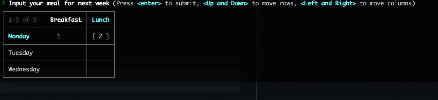

# inquirer-input-table

> A table-like input prompt for [Inquirer.js](https://github.com/SBoudrias/Inquirer.js)
> Reference: [inquirer-table-prompt](https://github.com/eduardoboucas/inquirer-table-prompt)




## Installation

```
npm install --save inquirer-input-table
```

## Usage
After registering the prompt, set any question to have `type: "table-input"` to make use of this prompt.

The result will be an object, containing the value for each cell.

```js
inquirer.registerPrompt('table-input', require('./index'))

const testInputTable = () => {
  inquirer
    .prompt([
      {
        type: 'table-input',
        name: 'MealPlan',
        message: 'Input your meal for next week',
        columns: [
          {
            name: 'Breakfast',
          },
          {
            name: 'Lunch',
          },
        ],
        rows: [
          {
            name: 'Monday',
          },
          {
            name: 'Tuesday',
          },
          {
            name: 'Wednesday',
          },
        ],
      },
    ])
    .then((answers) => {
      /*
      [Notice] key: [{row}_{column}]
    {
      MealPlan: {
        Monday_Breakfast: 'bread',
        Monday_Lunch: '',
        Tuesday_Breakfast: 'bread',
        Tuesday_Lunch: 'steak',
        Wednesday_Breakfast: 'noodles',
        Wednesday_Lunch: 'chicken'
      }
    }  
    */
      console.log(answers)
    })
}
```

### Options

- `columns`: Array of options to display as columns. Follows the same format as Inquirer's `choices`
- `rows`: Array of options to display as rows. Follows the same format as Inquirer's `choices`
